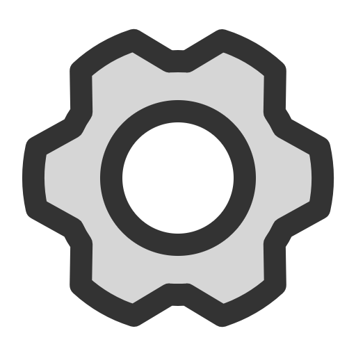
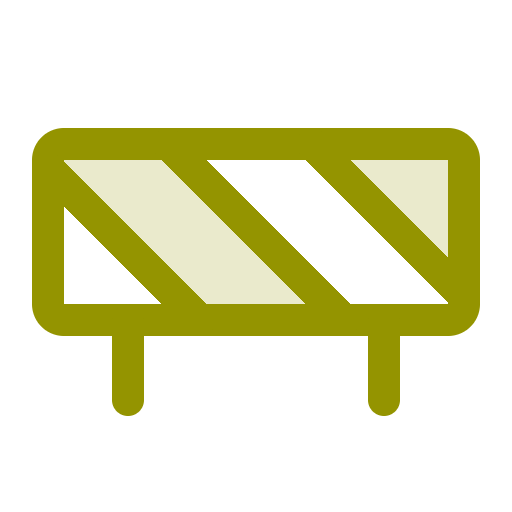

<h1 align="center">Gear</h1>

<i>A plugin for configuring <a href="https://github.com/oliverbooth/BrackeysBot">BrackeysBot</a> plugins.</i>

## About

This plugin exposes a web interface that searches for settings in other bots and displays configuration pages for those
plugins. It does so by serving a webhost from the plugin's assembly.

## How To Use

<ol>
    <li>Get the BrackeysBot up and running by <a href="https://github.com/BrackeysBot/BrackeysBot/wiki/Getting-started">following these steps</a>.</li>
    <li>Get the Gear plugin files by:
        <ul>
            <li><a href="https://github.com/auvalice/gear/releases/latest">Downloading the latest release</a>.</li>
            <li><a href="#Building-Gear">Building it yourself</a>.</li>
        </ul>
    </li>
    <li>Copy both <code>Gear.dll</code> and the <code>wwwroot</code> directory to the BrackeysBot plugins directory.</li>
    <li>(For some reason the bot currently doesn't play ball nicely with this plugin. Copy <code>Gear.dll</code> to the library folder as well.)</li>
    <li>Run BrackeysBot.</li>
</ol>

By default, Gear will expose a web service on port 5000. The root contains the web interface, and the <code>/api</code> route contains... the API!

The published website files are created from <a href="https://github.com/auvalice/gear-frontend">the Gear frontend
repository</a>, but you can serve any static website by replacing the contents of the <code>wwwroot</code> folder.

Supplying a Discord token for the bot is optional, as this plugin currently does not expose any Discord-related
functionality. However, it could be useful to have the bot serve as some kind of status indicator for the plugin.

## Building 

The current build process is not ideal. You need to remove the package references to BrackeysBot and any dependant
plugins, clone the repositories where these references came from, and then add them back as project references.

Gear itself references no other plugins. However, launching Gear without any other plugins loaded makes little sense.
It's suggested to at least load the <a href="https://github.com/brackeysbot/brackeysbot.core">Core</a> plugin to ensure you've got something to test.

## Making your plugin Gear-compatible 

There is no current good way for plugins to be intentionally Gear-compatible. An idea would be having plugins implement
an API that'll perform certain Gear calls.

For now, Gear will attempt to load plugin configurations by following the style laid out by the Core plugin. This means
that it'll traverse all `API` projects loaded, find the <code>Configuration</code> classes and load the fields that are
decorated with JSON attributes.

## Contributing

See [CONTRIBUTING](CONTRIBUTING.md) for details. Personally, I _suck_ at reviewing others' code in a timely fashion, but
feel free to submit PRs.

## License

Gear falls under the [MIT License](LICENSE.md).

## Disclaimer

BrackeysBot and its plugins is tailored for use within the [Brackeys Discord server](https://discord.gg/brackeys). While
the framework is open source and you are free to use it in your own servers, you accept responsibility for any mishaps
which may arise from the use of the software. Use at your own risk.
